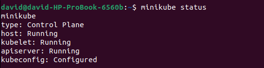
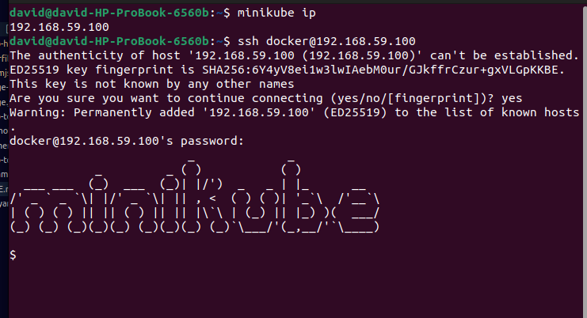
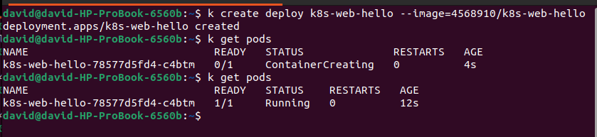
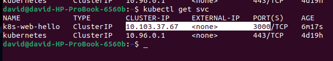
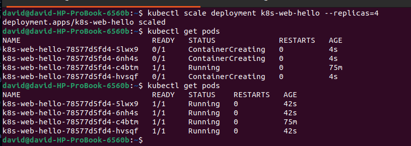

# Project 2: (Give it a name)

## __Requirements__ :
* VirtualBox
* Minikube
* Kubectl

> A quick note on **Minikube**: \
 Minikube is a tool that allows us provision a K8s cluster locally. It provisions a single node which will serve as both a master node and the worker node. \
 And we can interact with minikube using ```kubectl```

    

## Step 1: Create a Minikube node using the virtualBox driver
``` sh
$ minikube  start --vm-driver=virtualbox
```

You could check the status of the node using 
``` sh
$ minikube  status
```
It should look something like this... 





If you'd like to ssh into the minikube node, you need to first get the node ip address and then ssh into the node like this:
``` $ minikube ip ```

And the ssh into the the node using 
```ssh docker@{the_ip_address_goes_here} ```



>Take note the default minikube credentials are:
> - username: docker
> - password: tcuser

We can pull an image into the node and run it (since docker is installed into the minikube node by default) using ```kubectl``` like this:
``` bash
$ kubectl run nginx-image --image=nginx
```
> Where: \
    "nginx-image": is the name we want to give to the image \
    "--image=nginx": specifies the image to pull from dockerhub


## Deployments, Scaling & Service _(Explanation)_
---

The best way to manage pods within a node is by using deployment and service yaml files.

Deployments allow us to define a pod's properties
like number of replicas and the image from which the pods should be created.


# Creating an Express Web Server and Exposing a Port

## Step 1: Creating the Docker image
---
First copy the ```./k8s-web-hello``` folder and paste in your working directory

> - The [index.mjs](./k8s-web-hello/index.mjs) file contains a simple web server that responds and an endpoint that responds with a greeting from the pod. \
> - The Dockerfile contains instructions needed to build the Docker image

Next, cd into the ```./k8s-web-hello``` folder and run the following command to build the docker image.

``` bash
 $ docker build . -t 4568910/k8s-web-hello
``` 
The ```-t``` flag allows us specify a tag name  for this image. I used my dockerhub repo in the format {username}/{repo_name}

The next step will be to push your image to your docker repo using:
```
$ docker push {username}/k8s-web-hello
```

In my case, that would be:
```
$ docker push 4568910/k8s-web-hello
```
---
## Step 2: Creating Pods using Deployments
---
Deployments allow us to define a pod's properties like number of replicas and the image from which the pods should be created.

The recommended way of creating deployments is by using yaml files. However, let's try the command line way a little.

Here's the syntax for creating a simple deployment:
```
$ kubectl create deployment {give_deploymet_a_name} --image={dockerhub_username}/{repo_name}
```

So for our k8s-web-hello image, that would be:
```
$ kubectl create deployment k8s-web-hello --image=4568910/k8s-web-hello4568910/k8s-web-hello 
```

...and then run
``` bash
$ kubectl get pods # ...to see the pod that was created.
```

The output should look like...



> Note: \
> For me, I noticed that initially docker could not pull the image from the hub, so I had to ssh into the node and do the `docker pull` myself. (Just in case you get a similar error)
---

## Step 3: Exposing Ports Using a Service
---

If you check the [./k8s-web-hello/index.mjs](./k8s-web-hello/index.mjs) file, you'll notice that the web server is running at `port 3000`. However, that port will not be accessible to the outside world. We have to expose it using a service.

In order to expose port 3000 on the k8s-web-hello deployments, run:

``` sh
# create the service
$ kubectl expose deployment k8s-web-hello --port=3000


# lookup the services
$ kubectl get svc 
```



> Note: \
Not specifying the type of service will default to "Cluster IP" type which is only accessible within the cluster and not form the outside world. \
This would meant that we cannot communicate with the pods of that deploymet from our local machine, except we enter into the node (via ssh).

ssh into the minikube node and run:
``` bash
$ curl <service_ClusterIP>:<exposed_port>
```
For me, that would be:
``` bash
$ curl 10.103.37.67:3000

#Output:    
# Hello from the k8s-web-hello-78577d5fd4-c4btm$ 
```

## > Try scaling up pods using the deployment 
The command for this is:
``` bash
$ kubectl scale deployment <deployment_name> --replicas=<desired_number_pods>
```

For Example
``` bash
$ kubectl scale deployment k8s-web-hello --replicas=4
```


>Extra: \
When we scale like this, Kubernetes balances the incoming load across the pods

Moving on...

---

## Step 4: Make Deployment Accessible from Outside the Cluster
---


